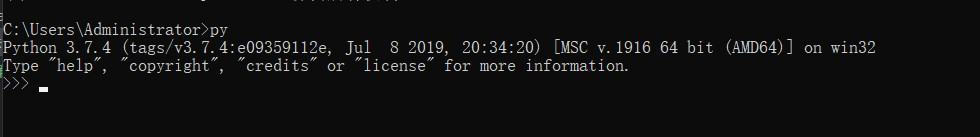
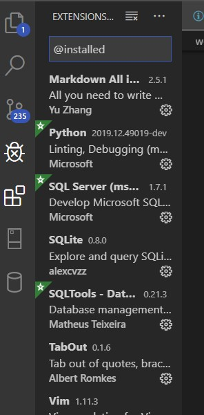
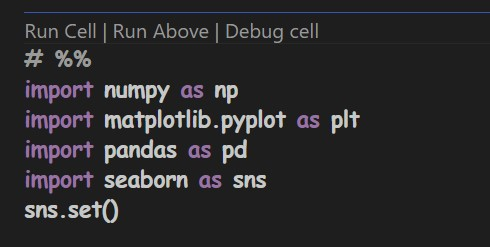

# Week 3: Python环境安装教程-最完美的python配置方法

> 不要使用Anaconda!
> 
> 不要使用Anaconda!
> 
> 不要使用Anaconda!

# 为什么不要用Anaconda?

这里时针对初学者而言的，我个人暂时不知道工业界是怎么配置数据开发环境。但对初学者而言，使用Anaconda效率太低了。

Anaconda启动速度慢，启动之后还要再启动IDE，对于性能稍差的电脑来说，可以说是龟速了。而且Anaconda集成的spyder编辑器非常垃圾，你说可以启动jupyter? 抱歉，初学者从anaconda进入jupyter后连jupyter文件目录在哪都不知道，而且同样是龟速启动啊。

然后，就是Ananconda集成了很多数据科学包？大多数是不用的，反而造成了Anaconda臃肿。你需要用的一个个`pip install` 有多难？

# 最好的Python配置

简单说就是

Python+VSCode+Jupyterlab


## Python安装


[下载地址Python3.8](https://www.python.org/downloads/release/python-380/)

这需要说的不多，无非是安装的时候记得点击**添加到环境变量**: 勾上`Add Python 3.x to path`选项


另外，如果你的C盘比较紧张，可以点击`Cusomise Installation` 安装到其他盘，但要注意两点：

- 不管是否自定义，一定要先把`add Python 3.x to path`勾上
- 自定义安装是不会自动创建Python文件夹的，你需要在你想安装的盘上面，比如E盘，新建一个Python文件夹，比如(`E:/Python37/`)

最后验证是否安装成功，打开cmd，输入
```
py
```

如果成功显示




好，python安装成功！

## pip安装python第三方包

Anaconda最多的赞誉是集成了很多Python科学计算包，不需要自己安装。但我觉得一个个包安装就有那么麻烦？而且Anaconda集成的包大多不用，白白浪费电脑资源。

这里用`pip`安装和管理第三方Python包

进入cmd，逐个输入
```
pip install numpy # Python数值计算包
pip install pandas # Python数据处理
pip install matplotlib # Python数据可视化
pip install scikit-learn # Python经典机器学习
```
验证是否安装成功
```
py # 进入python交互环境
import numpy as np # 安装成功的话，什么也不显示
np.__version__ # 显示版本号
```


## JupyterLab--更强大的jupyter

jupyterlab是新一代的jupyter，比前辈jupyter notebook更完美：

- 颜值更高了


- 十分便捷强大的插件拓展管理(需要Node.Js)
- 更人性化的UI管理界面
- 可以在jupyter lab上做更多的事
  - 画思维导图
  - 写SQL
  - 写markdown
- 更好的集成多种编程语言(R, Julia等)

废话到此为止，安装方法，进入cmd:
```
pip install jupyterlab
```
时间会比较长，因为需要安装很多依赖包。

安装完后，关闭cmd。随便一个地方，新建一个文件夹，
然后按住`shfit`，右键点击那个文件夹，你就会看到**在此处打开powershell**这个选项。进入powershell, 输入
```
jupyter lab
```
等一会，就可以进入到了jupyter lab里面(jupyter依赖于浏览器，这里建议默认使用Google Chrome)了。在`launcher`启动器上面点击python3，就会在那个文件夹里新建一个`.ipynb`文件，就可以在上面写python了。

这样做还有个好处就是，你可以直接把数据集放到你新建的那个文件夹里，然后用jupyter 直接读进去，不用考虑什么工作环境配置的问题.


## VSCode安装(可选)

> 鉴于vscode上手有一定的学习成本，这里仅仅作为可选的方法推荐。对于纯小白而言，可能很难理解vscode的各种功能和设计。

VSCode可以说是和Python天生一对，关于她的优点，公众号大佬们已经吹的够多了，这里就先不说。

[vscode下载地址](https://code.visualstudio.com/)

这里需要注意的是，vscode有两种版本，一种是stable，一种是insider版本。一般人都会选择stable,但stable在win10 1809之后版本**不能离线运行**，也就是说，如果你的电脑是win10 那么stable版vscode无法在断网的情况下启动。如果你对你的网络状况不是很乐观，那就直接安装insider版本吧，她可以离线运行。

安装过程需要注意的是，你是否要安装在C盘，下一步不要点太快，不小心安装在C盘了。当然，你C盘够大无所谓。

安装完毕后，打开，是不是有种眼前一亮的感觉？光颜值就可以秒杀宇宙所有IDE。

### vscode安装python拓展




也很简单，点击拓展图标(四个方块)那个，输入python，然后安装最上面那个就是了，上图也有。

VSCode的python集成了代码提示、代码补全的功能。


### vscode运行jupyter

- vscode运行原生jupyter
- vscode通过python interactive window运行jupyter

第一种没啥可说的，按住`F1`调出命令，输入create new notebook就可以了。但目前这个功能还不完善，无法体现vscode强大的地方。

第二种才是vscode的大杀器所在--cell debugger

随便新建一个`.py`文件，输入`# %%`(空格可以不要)会出现
分隔符(英语叫codelens)，然后`shift+enter`，右边就会显示python interactive window,这时候你可以像在jupyter上面一样写代码，然后`shift+enter`运行



看到那个`Debug cell`了吗，这个就是vscode的大杀器，可以在jupyter 上进行断点调试，具体效果


这里就不多说了，懂编程的自然知道这个debugger有多重要


